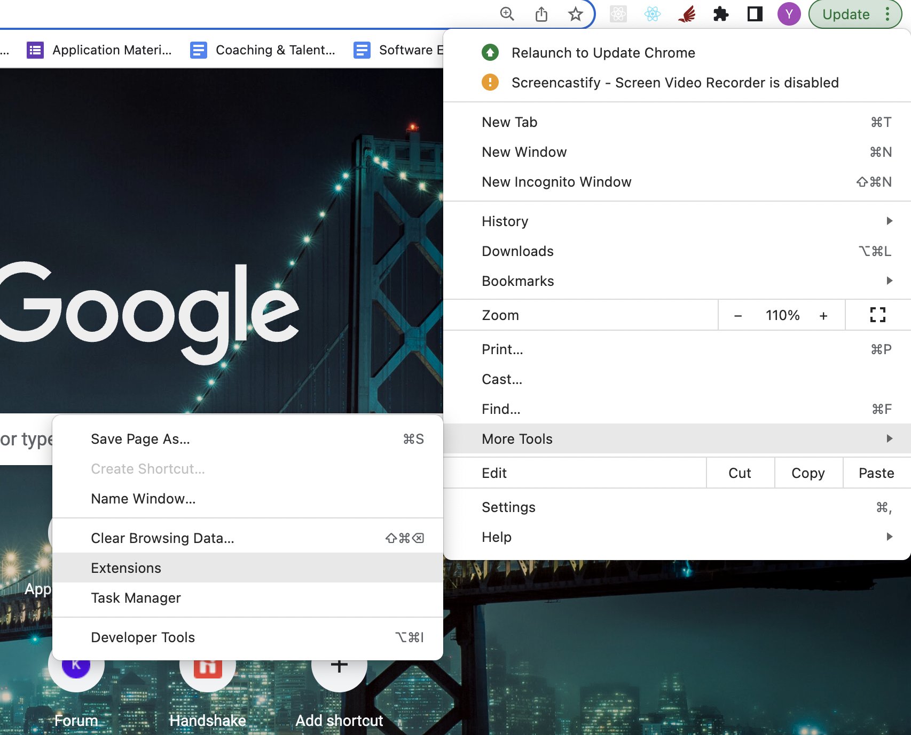
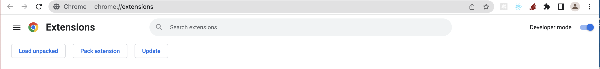
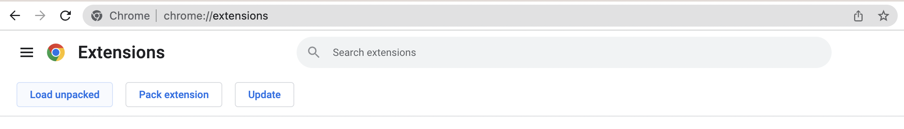
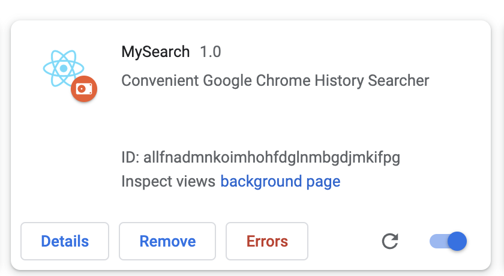
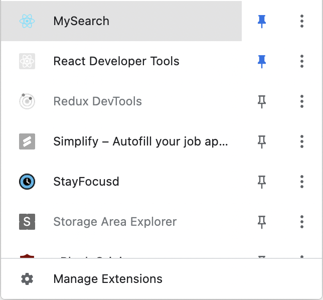
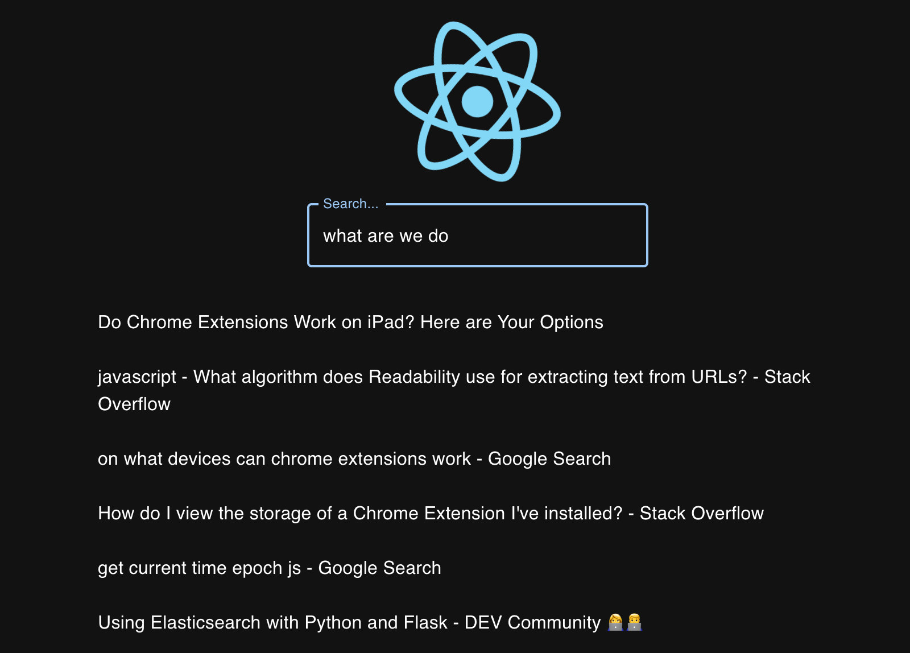

# MySearch

## Note:
MySearch backend ia already hosted on a public domain: mychromehistory.world.
Testing the application would just require setting up the Chrome extension locally

## Set up Chrome Extension

### Find Extensions on Google Chrome

### Turn "Developer mode" on 

### Select "load unpacked"

### Select the build file inside /mysearch/frontend/ to add MySearch to your list of extensions

### Click MySearch in the list of extensions

### Start using MySearch

